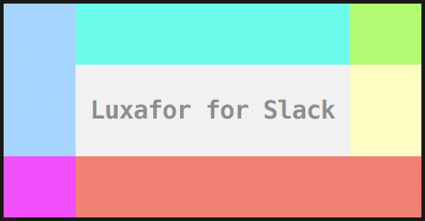

<p align="center">
  
  <br>
</p>

#### Luxafor for Slack CLI

[](https://github.com/loklaan/luxafor-for-slack/issues/new?title=Application:+Adopt+Project)

Make your [Luxafor](http://luxafor.com/) light change colours in sync with your [Slack](https://slack.com/) statuses.

**Green**: Active  
**Red**: Away / Do Not Disturb

## Install

```shell
npm i -g luxafor-for-slack
luxafor-for-slack
```

### Credentials

The following Slack API credentials are required to use this program:

* User **Token** _(generate a token [here](https://api.slack.com/web))_
* Client **ID** & **Secret** _(generated by creating a [slack application](https://api.slack.com/applications))_

In running this program, you will be prompted to provide these three required credentials.

## Todo

* Allow user to configure Luxafor colors & arrangements

## Contribute

### Issues

Feel free to open issues with questions or requests.

However, this is a fun one-off project, so my responses may be slow.

### Develop

Install dependencies.

```shell
$ git clone git@github.com:loklaan/luxafor-for-slack.git
$ cd luxafor-for-slack
$ npm i
```

Credentials are managed by [configstore](https://github.com/yeoman/configstore).

Go through the [Todo](#todo) list and develop.

## Credits

To all the authors that wrote the dependencies.
